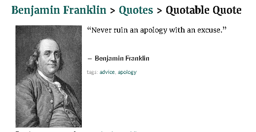

# სისტემის ზოგადი აღწერილობა

## ფილტრაცია & ძებნა

> Never ruin an apology with an excuse

## ობიექტების იერარქია

## ნავიგაცია

## ჩანაწერების ადმინისტრირება - ლოგები

## What is a CustomJob and How do I create it

That's a tough question but thankfully, our team is on it. Please bear with us while we're investigating.

## ტესტი

Yes, after a few months we finally found the answer. Sadly, Mike is on vacations right now so I'm afraid we are not able to provide the answer at this point.

